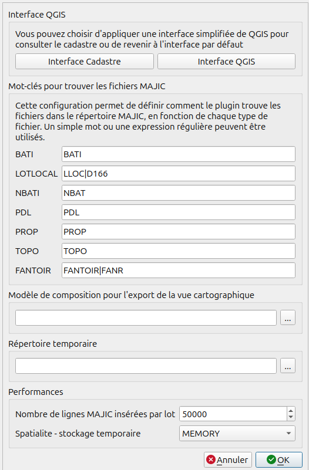

# Configuration

Avant d'importer les premières données cadastrales dans la base de données, il faut au préalable configurer le
plugin :

* Menu **Cadastre > Configurer le plugin** ou l'icône **outils** de la barre d'outil Cadastre

## Interface

Les 2 boutons **Interface Cadastre** et **Interface QGIS** permettent d'ouvrir une aide pour appliquer une 
interface simplifiée adaptée à une utilisation de consultation du Cadastre.

À ce jour, QGIS ne permet pas de modifier dynamiquement l'interface via un plugin. Nous incorporerons cette 
fonctionnalité lorsque ce sera possible. En attendant, il faut donc le faire manuellement, comme expliqué dans 
la fenêtre d'aide.

## Nom des fichiers MAJIC

Cette partie permet de spécifier comment sont appelés les fichiers MAJIC sur votre poste de travail. En effet,
les conventions de nommage peuvent changer d'un département à l'autre. Souvent, les fichiers se terminent par 
une extension relative au département et à la direction, par exemple .800 pour les fichiers du département de 
la Somme.

**Il est important de bien configurer ces noms de fichiers avant votre premier import.**

Si le plugin ne trouve pas les fichiers MAJIC pendant l'import, alors que vous aviez spécifié le bon 
répertoire d'import, un message vous avertira et vous proposera d'annuler l'import.

## Modèle de composition pour l'export de la vue cartographique

Vous pouvez choisir ici le modèle de composeur d'impression qui sera utilisé dans la fonction **Export la 
vue**. Un modèle est fourni dans le répertoire *composeur* du plugin, et sera utilisé si vous ne proposez pas
le vôtre.

Pour l'instant, le modèle gère un bloc de carte, mais pas les blocs de table attributaire.

## Répertoire temporaire

Vous pouvez choisir le répertoire dans lequel les scripts seront copiés, et les fichiers décompressés. 
Choisissez un répertoire contenant assez de place pour stocker les fichiers temporaires, surtout si vous 
souhaitez charger des données volumineuses.

Ce répertoire est aussi celui dans lequel les **relevés parcellaires** et les **relevés de propriété** seront
exportés.

## Performances

Vous pouvez modifier dans ce groupe les options suivantes pour adapter le plugin aux performances de votre 
matériel :

* **Taille maximum des requêtes INSERT** : C'est le nombre total de requêtes `INSERT` lancées dans un groupe de 
  modification (BEGIN/COMMIT). Vous pouvez baisser le chiffre jusqu'à 10000 si vous avez une machine légère 
  et un gros volume de données à importer. Plus le chiffre est bas, plus l'import initial peut prendre du 
  temps.

* **Stockage temporaire** : Le mode *MEMORY* est plus rapide, mais nécessite assez de mémoire vive pour 
  stocker les données à traiter. Le mode *DEFAULT* est plus lent et adapté à des ordinateurs avec peu de 
  mémoire vive.
