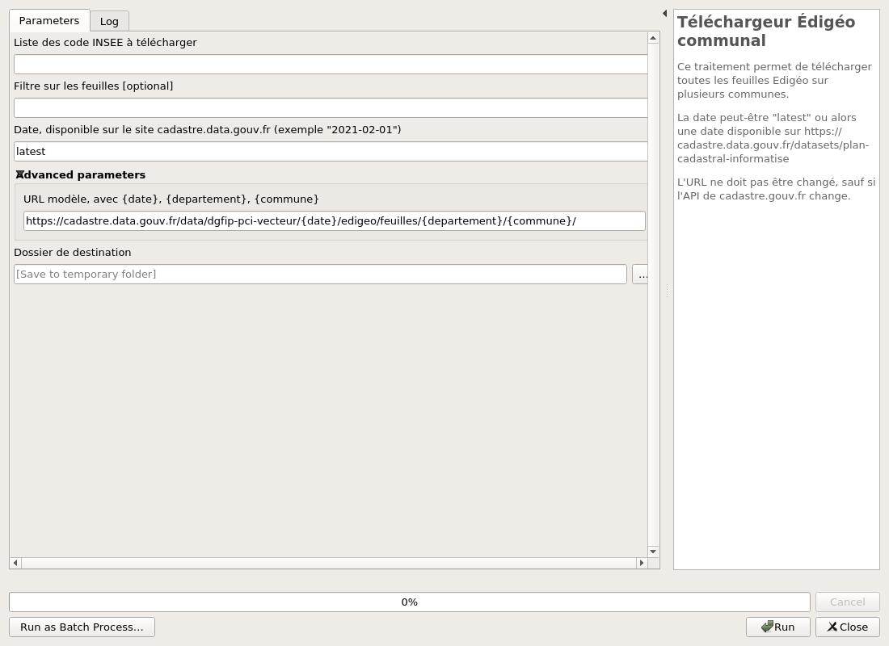

# Données

## Edigéo

Les données sont disponibles en téléchargement sur https://cadastre.data.gouv.fr.
Elles ne comportent pas de données sensibles.

Il est possible de télécharger les données à l'échelle départementale ou alors communale.

Dans l'extension QGIS, il existe, dans la boîte à outils **Traitement**, un téléchargeur pour les fichiers 
Edigeo.

Pour utiliser l'outil :

* Un code INSEE ou une liste de code INSEE, exemple `25047` ou `25047,25602`.
* Le filtre est _optionnel_. Il s'applique sur chacune des communes ci-dessus pour filtrer les feuilles :
    * S'il est vide, alors toutes les feuilles.
    * `AB,AD`, toutes les feuilles sur toutes les communes qui contiennent `AB` ou `AD`.
    * `256020000C,250470000D`, toutes les feuilles `0C` sur `25602` et `0D` sur `25047`.
    * `256020000C01,250470000D01`, uniquement les **2** feuilles.
    * `25602,25047000AB`, toutes les feuilles de `25602` et les feuilles `AB` sur `25047`
* La date est par défaut `latest` ou alors une date disponible sur 
  https://cadastre.data.gouv.fr/datasets/plan-cadastral-informatise selon le format `AAAA-MM-JJ`.

## Magic

Il faut y avoir un accès. Ce sont des données sensibles.

## OpenMagic

Ces données ne sont pas supportées par l'extension. N'hésitez pas à nous contacter.
