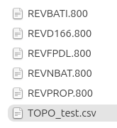

# Import des données

Cette boite de dialogue permet de réaliser un **import de données EDIGEO et MAJIC**.


## Principe

L'extension permet l'import de données **MAJIC de 2012 à 2025 et des données EDIGEO**. Il est possible
d'importer des données de manière incrémentale, **étape par étape**, ou bien d'importer **en une seule fois**.

L'extension utilise pour cela la notion de **lot**. Un lot regroupe un **ensemble de données cohérent** pour
votre utilisation. Par exemple, le lot peut être le code d'une commune ou l'acronyme d'une communauté de
commune. C'est une chaîne de 10 caractères maximum. Vous pouvez utiliser des chiffres ou des lettres.

Vous pouvez par exemple importer les données dans cet ordre :

* données EDIGEO de la commune A, lot "com_a"
* données EDIGEO de la commune B, lot "com_b"
* données MAJIC de la commune A, lot "com_a"
* données EDIGEO de la commune A, lot "com_a" (ré-import et écrasement des données précédentes)
* données EDIGEO de la commune C, lot "com_c"

Il est donc important de conserver une liste des lots définis pendant les imports successifs, pour savoir
ensuite quel lot utiliser si on souhaite écraser des données. Une version prochaine de l'extension pourra intégrer
un tableau récapitulatif des imports effectués dans une base de données pour faciliter le suivi des imports
réalisés.


!!! tip
    Il est conseillé d'importer des données de millésime différents dans des bases de données ou des schémas
    PostgreSQL différents, car la structure peut changer d'un millésime à l'autre (ajout de colonnes,
    modification de longueur de champs, etc).

## Bases de données

Deux **Systèmes de Gestion de Bases de Données** (SGBD) sont supportés par l'extension Cadastre :

* **PostgreSQL** et son extension spatiale **PostGIS**
* **SQLite** et son extension spatiale **Spatialite**

Nous conseillons d'utiliser PostgreSQL pour des données volumineuses et pour gérer des multiples accès à la
base de données.

Pour les bases de données **PostGIS**, il faut :

* avoir créé **une base de données** sur laquelle on a les droits en écriture et activer l'extension PostGIS.
* avoir créé au préalable **une connexion QGIS** via le menu **Couches > Ajouter une couche PostGIS** vers
  cette base de données

Pour les bases de données **Spatialite**, l'interface d'import permet de créer une base de données vide et la
connexion QGIS liée si nécessaire.

### Remarque sur les contraintes

Il n'existe actuellement aucune contrainte de clés étrangères sur les tables du schéma cadastre. Nous
proposerons à l'avenir un script qui permettra de les créer, lorsque les données le permettent (ce qui n'est
pas toujours le cas, comme des voies non référencées dans `voie` mais référencées dans `parcelle`).

## Données

### Edigeo

Vous pouvez utiliser le téléchargeur Edigeo dans la boîte à outil **Traitements** de QGIS, dans l'extension
**Cadastre**.

### FANTOIR

Le support des fichiers **FANTOIR** a été **abandonné début 2024** au profit du support des fichiers TOPO.

### TOPO

Si vous ne possédez pas les données TOPO dans votre jeu de données MAJIC, **nous conseillons de les télécharger** sur le
[site du CRAIG](https://drive.opendata.craig.fr/s/opendata?path=%2Fadresse%2Ftopo).

Une fois le fichier TOPO récupéré (par exemple `TOPO_34.csv.gz`) décompressez-le pour placer le CSV décompressé (par exemple `TOPO_34.csv`) au même niveau que les autres fichiers MAJIC. **Attention**: Le fichier `.gz` n'est pas reconnu et peut être supprimé une fois décompressé.

**Important** :

* par défaut, le plugin recherche les fichiers dont le nom contient `TOPO` (voir plus bas **Configurer l'extension**).
* il faut respecter **l'entête des fichiers CSV** comme produits par le CRAIG. Les fichiers récupérés sur le site national n'ont pas la bonne entête. Il faut remplacer notamment les espaces par des `_`.
  * accepté :
    `code_topo;nature_de_voie;libelle;type_commune_actuel_r_ou_n;type_commune_fip_r_ou_nfip;rur_actuel;rur_fip;caractere_voie;annulation;date_annulation;date_creation_de_article;type_voie;mot_classant;date_derniere_transition`
  * non accepté :
    `code topo;nature de voie;libelle;type commune actuel (R ou N);type commune FIP (R ou NFIP);RUR actuel;RUR FIP;caractere voie;annulation;date annulation;date creation de article;type voie;mot classant;date derniere transition`



## Les étapes d'importation

Pour lancer l'importation, il faut bien avoir au préalable configuré les noms des fichiers MAJIC via le menu
**Configurer l'extension**. Ensuite, on ouvre la boite de dialogue

* via la **barre d'outil Cadastre**, icône base de données
* via le menu **Cadastre > Importer des données**

On configure ensuite les options :

* Choisir **le type de base de données** : PostGIS ou Spatialite
* Choisir **la connexion**

    - Pour Postgis, on peut ensuite **choisir un schema**, ou en **créer un nouveau**
    - Pour Spatialite, on peut **créer une nouvelle base de données**

* Choisir le répertoire contenant les **fichiers EDIGEO** :

 - On peut sélectionner le **répertoire parent** qui contient l'ensemble des sous-répertoires vers les
   communes : l'extension ira chercher les fichiers de manière récursive.
 - Seuls les fichiers **zip** et **tar.bz2** sont pour l'instant gérés

* Choisir la **projection source** des fichiers EDIGEO et la **projection cible** désirée

* Choisir le **numéro du Département**, par exemple :
    * `80` pour la Somme
    * `97` pour la Guadeloupe
* Choisir le **numéro de la Direction**, par exemple :
    * `0`
    * `1` pour la Guadeloupe

* Choisir le répertoire contenant **les fichiers MAJIC**

    - Comme pour EDIGEO, l'extension ira chercher les fichiers dans les répertoires et les sous-répertoires et
      importera l'ensemble des données.

* Choisir la **version du format** en utilisant les flèches haut et bas

    - Seuls les formats de 2012 à 2025 sont pris en compte

* Choisir le **millésime des données**, par exemple 2025

* Choisir le **Lot** : utilisez par exemple le code INSEE de la commune.

* Activer ou désactiver la case à cocher **Corriger les géométries invalides** selon la qualité de votre jeu
  de données EDIGEO.

* Utiliser la barre de défilement de la fenêtre pour aller tout en bas et afficher tout le bloc texte de log
  situé sous la barre de progression.

* Lancer l'import en cliquant sur le bouton **Lancer l'import**


Le déroulement de l'import est écrit dans le bloc texte situé en bas de la fenêtre.

!!! tip
    Pendant l'import, il est conseillé de ne pas déplacer ou cliquer dans la fenêtre. Pour l'instant, l'extension
    n'intègre pas de bouton pour annuler un import en cours.

## Outre-mer

Pour l'import des communes en France d'outre-mer, il faut découper le code du département pour avoir la direction.
Par exemple, concernant le département de la Guadeloupe, code INSEE `971`, dans l'extension Cadastre, le code du
département est `97` et la direction est `1`.

La projection des données **EDIGEO** peut se lire dans le fichier `*.GEO`.

Pensez à regarder si la projection est toujours la même dans les fichiers **EDIGEO**.

### Projections IGNF

Si votre donnée EDIGEO est en projection IGNF, par exemple pour la Guadeloupe, `IGNF:GUAD48UTM20` (Guadeloupe
Ste Anne), et que vous souhaitez importer les données dans PostgreSQL, il faut au préalable ajouter dans votre
table `public.spatial_ref_sys` la définition de la projection **IGNF**, au format **WKT**.
Si vous utilisez à la place l'équivalent **EPSG** (par exemple ici `EPSG:2970`), vous risquez un décalage des
données lors de la reprojection.

Vous pouvez ajouter dans votre base de données la définition via une requête, par exemple avec la requête
suivante pour `IGNF:GUAD48UTM20` avec la chaîne **WKT** décrivant la projection :

```sql
INSERT INTO spatial_ref_sys values (
    998999,
    'IGNF',
    998999,
    'PROJCS["Guadeloupe Ste Anne",GEOGCS["Guadeloupe Ste Anne",DATUM["Guadeloupe St Anne",SPHEROID["International-Hayford 1909",6378388.0000,297.0000000000000,AUTHORITY["IGNF","ELG001"]],TOWGS84[-472.2900,-5.6300,-304.1200,0.4362,-0.8374,0.2563,1.898400],AUTHORITY["IGNF","REG425"]],PRIMEM["Greenwich",0.000000000,AUTHORITY["IGNF","LGO01"]],UNIT["degree",0.01745329251994330],AXIS["Longitude",EAST],AXIS["Latitude",NORTH],AUTHORITY["IGNF","GUAD48GEO"]],PROJECTION["Transverse_Mercator",AUTHORITY["IGNF","PRC0220"]],PARAMETER["semi_major",6378388.0000],PARAMETER["semi_minor",6356911.9461],PARAMETER["latitude_of_origin",0.000000000],PARAMETER["central_meridian",-63.000000000],PARAMETER["scale_factor",0.99960000],PARAMETER["false_easting",500000.000],PARAMETER["false_northing",0.000],UNIT["metre",1],AXIS["Easting",EAST],AXIS["Northing",NORTH],AUTHORITY["IGNF","GUAD48UTM20"]]',
    '+init=IGNF:GUAD48UTM20'
);
```

Attention, il est important d'utiliser un code qui est ≤ 998999, car PostGIS place des contraintes sur le
SRID. Nous avons utilisé ici `998999`, qui est le maximum possible.

!!! tip
    Pour trouver la chaîne **WKT** décrivant la projection, à défaut de la trouver sur internet pour le moment,
    nous pouvons utiliser l'API PyQGIS. Dans le menu **Extensions** → **Console Python**, écrire :

    ```python
    QgsCoordinateReferenceSystem('IGNF:GUAD48UTM20').toWkt()
    ```
    puis ++enter++

    Il existait auparavant une fichier SQL sur le site de l'IGN que l'on peut trouver sur la discussion
    [Georezo suivante](https://georezo.net/forum/viewtopic.php?pid=268134). Attention, il faut extraire de ce fichier
    la commande `INSERT` qui correspond à votre code `IGNF`, et remplacer le SRID par `998999`.

Ensuite, dans la projection source, vous pouvez utiliser `IGNF:GUAD48UTM20` au lieu du code EPSG correspondant.

En appliquant l'astuce PyQGIS ci-dessus, notons que le code interne est propre à votre base :

```sql
INSERT INTO spatial_ref_sys values (
    CODE INTERNE À VOUS COMME 998999,
    'IGNF',
    CODE INTERNE À VOUS COMME 998999,
    'RESULTAT DE LA LIGNE PyQGIS',
    '+init=NOM DE LA PROJECTION COMME IGNF:GUAD48UTM20'
);
```

??? note "Guyane"
    * Projection du fichier `.geo` : `IGNF:RGFG95UTM22`
    ```sql
       INSERT INTO spatial_ref_sys values (
       998995,
       'IGNF',
       998995,
       'PROJCS["RGFG95 UTM Nord f.22",GEOGCS["RGFG95 geographiques (dms)",DATUM["Reseau_Geodesique_Francais_Guyane_1995",SPHEROID["GRS 1980",6378137,298.257222101,AUTHORITY["EPSG","7019"]],AUTHORITY["EPSG","6624"]],PRIMEM["Greenwich",0,AUTHORITY["EPSG","8901"]],UNIT["degree",0.0174532925199433,AUTHORITY["EPSG","9122"]],AUTHORITY["IGNF","RGFG95G"]],PROJECTION["Transverse_Mercator"],PARAMETER["latitude_of_origin",0],PARAMETER["central_meridian",-51],PARAMETER["scale_factor",0.9996],PARAMETER["false_easting",500000],PARAMETER["false_northing",0],UNIT["metre",1,AUTHORITY["EPSG","9001"]],AXIS["Easting",EAST],AXIS["Northing",NORTH],AUTHORITY["IGNF","RGFG95UTM22"]]',
       '+init=IGNF:RGFG95UTM22'
       );
    ```

??? note "Mayotte"
    * Projection du fichier `.geo` : `IGNF:RGM04`
    ```sql
       INSERT INTO spatial_ref_sys values (
       998997,
       'IGNF',
       998997,
       'GEOCCS["RGM04 cartesiennes geocentriques",DATUM["Reseau_Geodesique_de_Mayotte_2004",SPHEROID["GRS 1980",6378137,298.257222101,AUTHORITY["EPSG","7019"]],AUTHORITY["EPSG","1036"]],PRIMEM["Greenwich",0,AUTHORITY["EPSG","8901"]],UNIT["metre",1,AUTHORITY["EPSG","9001"]],AXIS["Geocentric X",OTHER],AXIS["Geocentric Y",OTHER],AXIS["Geocentric Z",NORTH],AUTHORITY["IGNF","RGM04"]]',
       '+init=IGNF:RGM04'
       );
    ```

??? note "Réunion"
    * Projection du fichier `.geo` : `IGNF:RGR92UTM40S`
    ```sql
       INSERT INTO spatial_ref_sys values (
       998996,
       'IGNF',
       998996,
       'PROJCS["RGM04 UTM Sud fuseau 38",GEOGCS["RGM04 geographiques (dms)",DATUM["Reseau_Geodesique_de_Mayotte_2004",SPHEROID["GRS 1980",6378137,298.257222101,AUTHORITY["EPSG","7019"]],AUTHORITY["EPSG","1036"]],PRIMEM["Greenwich",0,AUTHORITY["EPSG","8901"]],UNIT["degree",0.0174532925199433,AUTHORITY["EPSG","9122"]],AUTHORITY["IGNF","RGM04G"]],PROJECTION["Transverse_Mercator"],PARAMETER["latitude_of_origin",0],PARAMETER["central_meridian",45],PARAMETER["scale_factor",0.9996],PARAMETER["false_easting",500000],PARAMETER["false_northing",10000000],UNIT["metre",1,AUTHORITY["EPSG","9001"]],AXIS["Easting",EAST],AXIS["Northing",NORTH],AUTHORITY["IGNF","RGM04UTM38S"]]',
       '+init=IGNF:RGR92UTM40S'
       );
    ```
