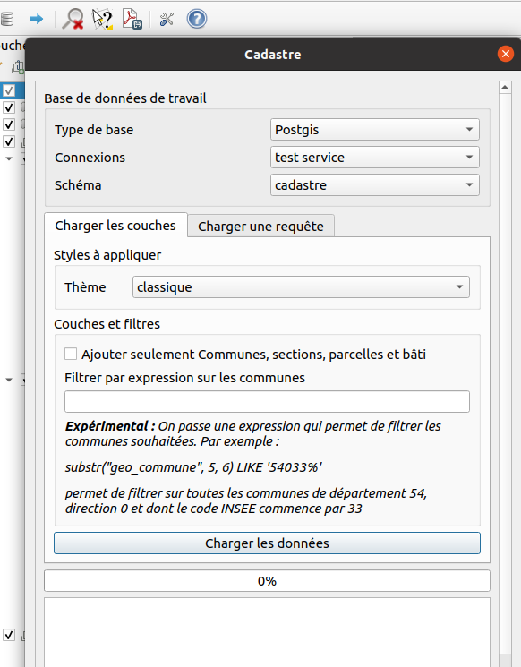
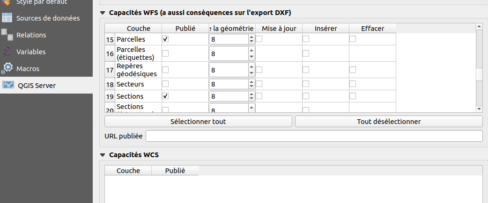

# Configuration

## Dans QGIS

Pour utiliser le module cadastre dans Lizmap Web Client il vous faut d'abord configurer un **projet QGIS**:

* Vous aurez besoin d'installer l'extension QGIS [Cadastre](https://github.com/3liz/QgisCadastrePlugin) sur votre QGIS Bureautique via le gestionnaire d'extensions, ainsi que sur votre serveur QGIS Server dans un dossier nommé `cadastre`.

* Il faut ensuite créer un projet QGIS contenant les données cadastrale, et le configurer avec cette extension:

  * Utilisez l'outil de **chargement des couches**, il configurera notamment les **variables** dans le projet ainsi que les couches requises.

    

  * Dans les **propriétés du projet**, onglet `QGIS Server`, il faut publier en WFS les couches `Communes`, `Parcelles` et `Sections`.

    

* Enfin vous devez créer ou modifier la configuration **lizmap** via le plugin Lizmap pour QGIS:

  * Il faut obligatoirement ajouter la couche `Parcelles` dans l'onglet **table attributaire**. Pour les performances, pensez à cocher aussi la case "Limiter les données à l'emprise courante"

    

  * Vous devez activer la **popup** pour la couche des `Parcelles`, via l'onglet `Couches` du plugin Lizmap. **ATTENTION** Selon le public visé, vous devrez adapter les champs visibles dans la popup de Lizmap, notamment les champs `proprietaire` et `proprietaire_infos` qui contiennent des données sensible issues des fichiers MAJIC.

    - Si vous utilisez la popup **Auto** de Lizmap, désactiver le WMS pour les champs souhaités dans l'onglet `Champs` des propriétés de la couche (tout à droite du tableau)
    - Si vous utilisez la popup **QGIS**, adaptez la configuration en supprimant le contenu HTML non souhaités, visible dans l'onglet `Affichage` (ou `Infobulle`) des propriétés de la couche, groupe `Infobulle HTML`

  * A noter que depuis la version **1.6.0** du module Cadastre, lorsque l'utilisateur a **le droit de voir les données de propriétaires**, le contenu détaillé des informations de la parcelle est **affiché sous le contenu de la popup**. Les onglets correspondent à ceux visibles dans QGIS lorsqu'on affiche le détail d'une parcelle: **Parcelle, Propriétaires, Subdivisions fiscales, Locaux, Locaux : informations détaillées**. Vous pouvez donc afficher moins d'information dans la popup, par exemple seulement le code de la parcelle et la commune

## Dans Lizmap

Maintenant vous devez configurer les droits d'accès à l'outil via l'interface d'administration. Le module a créé:

* un groupe d'utilisateurs `Cadastre Lizmap` (identifiant `cadastre_lizmap`)
* 2 sujets de droit : `Accéder aux données de propriétaires` et `Utiliser le panneau de recherche`

Vous pouvez mettre certains utilisateurs dans ce groupe `Cadastre Lizmap`. Ils auront alors accès au panneau de recherche par localisation **ET** par nom de propriétaires. **Vous devez bien faire attention de n'accorder le droit `Accéder aux données de propriétaires` qu'aux personnes habititées !**.

Vous pouvez modifier plus finement les droits via le bouton `Changer les droits des groupes` situés dans le menu `Groupes d'utilisateurs pour les droits` de l'interface d'administration de Lizmap Web Client. *Attention, cette page modifie fortement les droits par défaut des groupes d'utilisateurs. Nous conseillons de ne pas touchez aux droits liés à Lizmap ici, sauf si vous maîtrisez ce que vous faites.*
