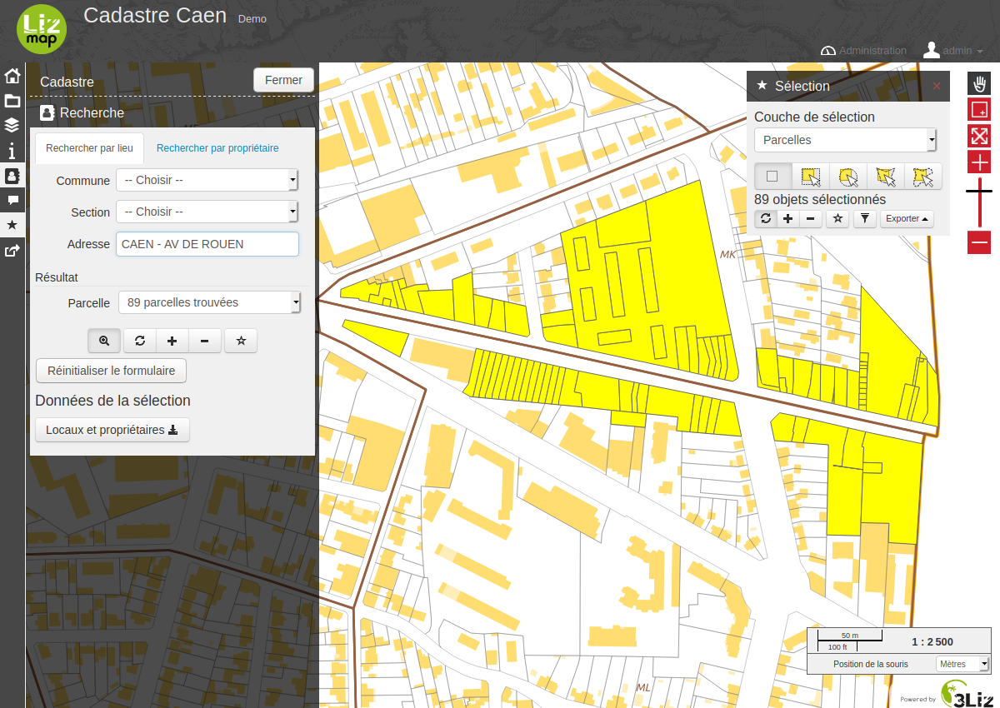

# Module Lizmap

Il est possible d'exploiter les données cadastrales dans l'interface web de
[Lizmap](https://github.com/3liz/lizmap-web-client/).

Pour cela, il faut :

* [installer](installation.md) le module sur le serveur Lizmap
* [configurer](configuration.md) le projet QGIS

